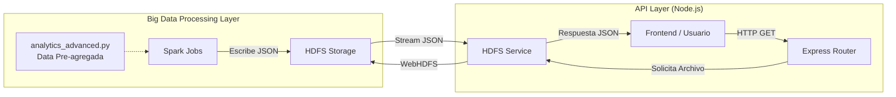

# Documentación Técnica de la API Node.js (V2)

## 1. Introducción
Esta API actúa como la capa de servicio entre el "Data Lake" (Hadoop HDFS) y cualquier cliente consumidor (como un Dashboard Frontend). Su función principal es exponer los resultados analíticos pre-calculados por Spark en formato JSON estándar, permitiendo una integración rápida y ligera sin sobrecargar el cluster de Big Data con consultas en tiempo real.

## 2. Arquitectura de la Solución

El diseño sigue un patrón de **Lectura Directa de Resultados**. Spark realiza el trabajo pesado (Heavy Lifting) de agregación y guarda los resultados finales en HDFS. La API Node.js simplemente lee y sirve estos archivos.



## 3. Estructura del Código

El código de la API reside en el directorio `api/src` y está organizado modularmente:

| Archivo / Directorio | Propósito |
| :--- | :--- |
| `app.js` | **Punto de Entrada**. Configura el servidor Express, Middlewares y monta las rutas (`/api` y `/api/v2`). |
| `routes/dashboard.routes.js` | **Definición de Endpoints V2**. Define qué URL (ej. `/payment-stats`) corresponde a qué archivo en HDFS. |
| `services/hdfs.service.js` | **Lógica de Conexión**. Encapsula la librería `webhdfs` para leer archivos del cluster. Maneja el streaming y la conversión de formatos (NDJSON a JSON Array). |

## 4. Catálogo de Endpoints (V2)

Todos los endpoints responden bajo el prefijo: `/api/v2`

### Tabla de Rutas Rápidas (Click para probar)
*   [http://localhost:3000/api/v2/system-stats](http://localhost:3000/api/v2/system-stats)
*   [http://localhost:3000/api/v2/trips-over-time](http://localhost:3000/api/v2/trips-over-time)
*   [http://localhost:3000/api/v2/payment-stats](http://localhost:3000/api/v2/payment-stats)
*   [http://localhost:3000/api/v2/top-zones](http://localhost:3000/api/v2/top-zones)
*   [http://localhost:3000/api/v2/tip-analysis](http://localhost:3000/api/v2/tip-analysis)
*   [http://localhost:3000/api/v2/distance-distribution](http://localhost:3000/api/v2/distance-distribution)

### 4.1. `GET /trips-over-time`
*   **Link**: [http://localhost:3000/api/v2/trips-over-time](http://localhost:3000/api/v2/trips-over-time)
*   **Propósito**: Mostrar la evolución temporal de la demanda. Útil para gáficos de línea.
*   **Fuente de Datos**: HDFS `/data/nyc/analytics/v2/trips-over-time`
*   **Estructura de Respuesta**:
    ```json
    [
      { "date": "2025-01-01", "total_trips": 1500, "avg_fare": 12.50 },
      { "date": "2025-01-02", "total_trips": 1800, "avg_fare": 13.10 }
    ]
    ```

### 4.2. `GET /payment-stats`
*   **Propósito**: Analizar preferencias de pago. Útil para gráficos de torta (Pie Charts).
*   **Fuente de Datos**: HDFS `/data/nyc/analytics/v2/payment-stats`
*   **Estructura de Respuesta**:
    ```json
    [
      { "payment_type": 1, "total_count": 5000, "payment_desc": "Credit Card" },
      { "payment_type": 2, "total_count": 2000, "payment_desc": "Cash" }
    ]
    ```

### 4.3. `GET /top-zones`
*   **Propósito**: Identificar zonas calientes (Hotspots). Útil para mapas de calor o gráficos de barras.
*   **Fuente de Datos**: HDFS `/data/nyc/analytics/v2/top-zones`
*   **Estructura de Respuesta**:
    ```json
    [
      { "ZoneID": 237, "pickup_count": 1200 },
      { "ZoneID": 161, "pickup_count": 980 }
    ]
    ```

### 4.4. `GET /tip-analysis`
*   **Propósito**: Entender comportamiento de propinas según distancia. Útil para gráficos de barras agrupadas.
*   **Fuente de Datos**: HDFS `/data/nyc/analytics/v2/tip-analysis`
*   **Estructura de Respuesta**:
    ```json
    [
      { "distance_bucket": "0-2 miles", "avg_tip": 1.5, "avg_total": 10.0, "tip_percentage": 15.0 },
      { "distance_bucket": "10+ miles", "avg_tip": 5.0, "avg_total": 45.0, "tip_percentage": 11.1 }
    ]
    ```

### 4.5. `GET /distance-distribution`
*   **Propósito**: Histograma de longitudes de viaje.
*   **Fuente de Datos**: HDFS `/data/nyc/analytics/v2/distance-distribution`
*   **Estructura de Respuesta**:
    ```json
    [
      { "miles": 1, "count": 3000 },
      { "miles": 2, "count": 2500 }
    ]
    ```

### 4.6. `GET /system-stats`
*   **Propósito**: Mostrar Dashboard Home Completo (Infraestructura + Resumen de Negocio).
*   **Fuente de Datos**: HDFS JMX (Cluster), HDFS Metadata (`/data/nyc`) y Agregación On-the-fly (`trips-over-time`).
*   **Estructura de Respuesta**:
    ```json
    {
      "infrastructure": {
        "health": "Normal",
        "active_datanodes": 1,
        "volume": {
          "capacity_total_bytes": 50000000000,
          "capacity_used_bytes": 104857600,
          "percent_used": "0.21"
        },
        "blocks": { "missing": 0, "corrupt": 0 }
      },
      "data_lake": {
        "total_files": 12,
        "size_bytes": 104857600
      },
      "dataset_summary": {
        "total_trips": 15000,
        "date_start": "2025-01-01",
        "date_end": "2025-01-31"
      },
      "last_check": "2025-12-22T20:50..."
    }
    ```

## 5. Decisiones de Diseño Clave

1.  **¿Por qué pre-calcular con Spark?**
    *   Ejecutar agregaciones sobre millones de filas en tiempo real (cuando el usuario carga la página) sería demasiado lento (segundos o minutos).
    *   Pre-calcular permite que la API responda en milisegundos.

2.  **¿Por qué lectura directa de HDFS?**
    *   Evita la necesidad de una base de datos intermedia (como MongoDB o PostgreSQL), simplificando la infraestructura para este caso de uso de "Lectura Analítica".

3.  **Manejo de NDJSON**
    *   Spark guarda archivos JSON particionados a veces como "Un objeto por línea" (NDJSON). La API incluye lógica (`hdfs.service.js`) para transformar este formato en un Array JSON válido que el Frontend pueda consumir directamente (`JSON.parse`).
