# 📊 Diagramas del Sistema NYC Taxi Analytics

Este documento centraliza todos los diagramas técnicos del proyecto para facilitar la comprensión visual de la arquitectura, el despliegue y los flujos de datos.

---

## 1. Diagrama de Despliegue (Infraestructura)

**Tipo: Mermaid C4 (Container)**

Este diagrama muestra cómo están contenerizados y conectados los servicios en el entorno Docker.

---

## 2. Diagrama de Flujo General (End-to-End)

**Tipo: Flowchart**

Describe el ciclo de vida completo del dato, desde que llega como archivo crudo hasta que se ve en la pantalla.

```mermaid
graph LR
    subgraph Ingesta
        A[Archivos .parquet Locales] -->|load_to_hdfs.py| B[(HDFS Raw)]
    end
    
    subgraph Procesamiento
        B -->|clean_data.py| C[Spark Cleaning]
        C -->|Escribe| D[(HDFS Processed)]
        D -->|analytics_advanced.py| E[Spark Analytics]
        E -->|Genera JSON| F[(HDFS Analytics V2)]
    end
    
    subgraph Consumo
        F -.->|Lectura WebHDFS| G[API REST]
        G -->|JSON Response| H[Dashboard Frontend]
        H -->|Visualización| I((Usuario))
    end
    
    style A fill:#f9f,stroke:#333
    style I fill:#f9f,stroke:#333
    style F fill:#bbf,stroke:#333
```

---

## 3. Flujos por Roles

### A. Equipo de Infraestructura (Pipeline ETL)

**Tipo: State Diagram**

Detalla los estados por los que pasan los datos durante el proceso de ETL (Extracción, Transformación y Carga).

```mermaid
stateDiagram-v2
    [*] --> RawData: init.sh / verify_env.bat
    
    state "HDFS /data/nyc/raw" as RawData
    state "Spark Job: Cleaning" as Cleaning
    state "HDFS /data/nyc/processed" as Processed
    state "Spark Job: Analytics" as Analytics
    state "HDFS /data/nyc/analytics/v2" as FinalData
    
    RawData --> Cleaning: clean_data.py
    Cleaning --> Processed: Limpieza & Validación
    Processed --> Analytics: analytics_advanced.py
    Analytics --> FinalData: Agregación & JSON
    FinalData --> [*]: Disponible para API
```

### B. Equipo Backend (API Request Cycle)

**Tipo: Sequence Diagram**

Muestra qué sucede internamente cuando el Frontend solicita datos a la API.

```mermaid
sequenceDiagram
    participant F as Frontend (Next.js)
    participant A as API API (Express)
    participant H as Hadoop (WebHDFS)
    
    Note over F,A: Usuario selecciona año "2024"
    F->>A: GET /api/v2/trips-over-time
    activate A
    
    A->>H: LISTSTATUS /data/nyc/analytics/v2/trips-over-time
    H-->>A: Lista de archivos part-00000...json
    
    loop Para cada archivo
        A->>H: OPEN /data/nyc/.../part-xxxxx.json
        H-->>A: Stream de contenido JSON
    end
    
    A->>A: Parsear y Unificar JSONs
    A-->>F: Respuesta JSON consolidada
    deactivate A
    
    F->>F: Renderizar Gráfico
```

### C. Equipo Frontend (Renderizado de Vistas)

**Tipo: Class Diagram (Simplificado)**

Muestra la relación entre las páginas principales y los componentes de visualización.

