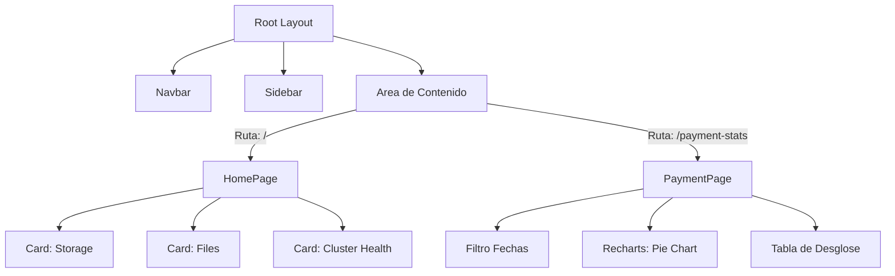
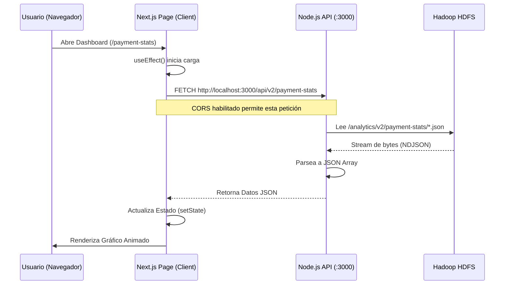

# Documentación del Frontend (NYC Taxi Dashboard)

## 1. Introducción y Tecnologías
El frontend es una aplicación web moderna diseñada para visualizar la analítica de datos de taxis de NYC. Se ha priorizado la velocidad de carga, la interactividad de los gráficos y una estética profesional ("Dark Mode" por defecto).

### Stack Tecnológico
*   **Core Framework**: [Next.js 14+](https://nextjs.org/) (App Router).
*   **Lenguaje**: TypeScript y React.
*   **Estilos**: [Tailwind CSS v4](https://tailwindcss.com/) (Motor de estilos atómicos).
*   **Componentes UI**: [Shadcn/ui](https://ui.shadcn.com/) (Componentes accesibles y personalizables).
*   **Visualización de Datos**: [Recharts](https://recharts.org/) (Gráficos compuestos y responsivos).
*   **Iconos**: Lucide React.

## 2. ¿Por qué Next.js? (Decisiones de Arquitectura)
Se eligió **Next.js** sobre soluciones puras de cliente (como Vite/React estándar) por las siguientes razones:

1.  **Server Components**: Permite renderizar la estructura inicial de la página en el servidor, mejorando el "First Contentful Paint" (FCP).
2.  **Enrutamiento Basado en Archivos**: La carpeta `app/` define las rutas automáticamente, simplificando la navegación (ej. `app/payment-stats/page.tsx` -> `/payment-stats`).
3.  **Optimización Automática**: Next.js optimiza fuentes, imágenes y scripts automáticamente.
4.  **Ecosistema Robusto**: Integración nativa con TypeScript y ESLint para un código más seguro y mantenible.

## 3. Estructura del Proyecto
El código se organiza siguiendo las mejores prácticas del "App Router" de Next.js:

```
fronted/
├── app/                        # Rutas y Páginas principales
│   ├── layout.tsx              # Layout global (Navbar, ThemeProvider)
│   ├── page.tsx                # Dashboard Home (System Stats)
│   ├── globals.css             # Estilos globales y variables de tema (CSS Vars)
│   └── [feature]/              # Páginas de características (ej. /payment-stats)
│       └── page.tsx            # Lógica de la página específica
├── components/                 # Bloques constructivos de la UI
│   ├── charts/                 # Gráficos aislados (PaymentChart, TripsChart, etc.)
│   ├── layout/                 # Componentes de estructura (Sidebar, Navbar)
│   └── ui/                     # Componentes base (Botones, Cards, Dropdowns)
├── lib/                        # Utilidades y Tipos
│   ├── types.ts                # Interfaces TypeScript para los datos de la API
│   └── utils.ts                # Funciones auxiliares (formateo de clases, fechas)
└── public/                     # Archivos estáticos
```

## 4. Inicialización y Despliegue

### 4.1. Configuración de Puerto
Por defecto, Next.js usa el puerto 3000, el mismo que nuestra API. Para evitar conflictos, se reconfiguró el proyecto para usar el puerto **3001**.
*   **Archivo**: `package.json`
*   **Cambio**: `"dev": "next dev -p 3001"`

### 4.2. Comando de Inicio Automatizado
Para facilitar la ejecución, no es necesario recordar comandos de NPM. Se ha creado un script en el directorio raíz del proyecto:

*   **Script**: `scripts/start_frontend.bat`
*   **Función**:
    1.  Navega al directorio `fronted`.
    2.  Verifica si existen `node_modules` (si no, ejecuta `npm install` automáticamente).
    3.  Inicia el servidor de desarrollo en el puerto 3001.

```bash
# Ejemplo de uso desde la terminal
.\scripts\start_frontend.bat
```

## 5. Diagramas de Arquitectura (Mermaid)

### 5.1. Jerarquía de Componentes
Muestra cómo se componen las páginas a partir de piezas más pequeñas.



### 5.2. Flujo de Datos (Data Fetching)
Los componentes de Next.js (Cliente) solicitan datos a la API (Backend), que a su vez lee de HDFS.



## 6. Personalización de Estilos
El diseño visual se controla centralizadamente mediante **Variables CSS** en `app/globals.css`. Esto nos permite:
*   **Temas**: Cambiar fácilmente entre Modo Claro y Oscuro.
*   **Consistencia**: Los gráficos de Recharts consumen estas mismas variables (ej. `var(--chart-1)`), asegurando que si cambias el color primario en CSS, todos los gráficos se actualizan automáticamente.
