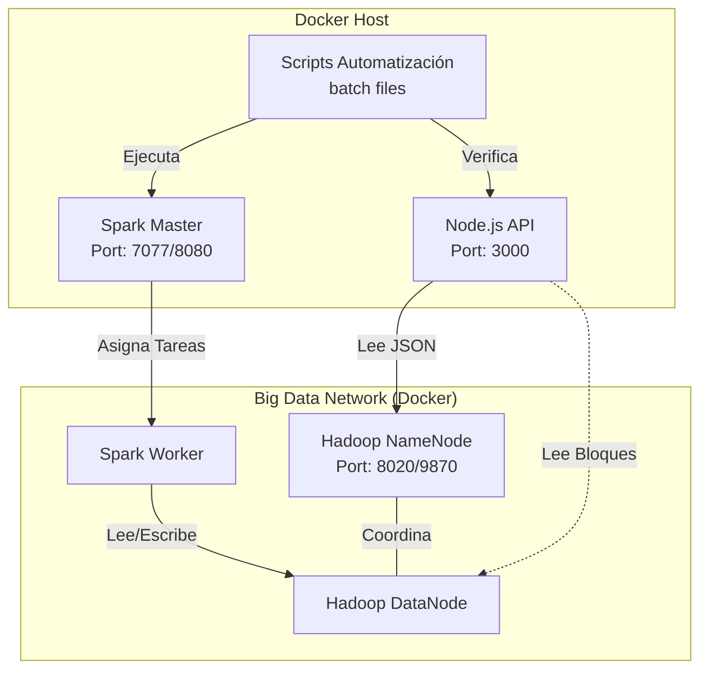
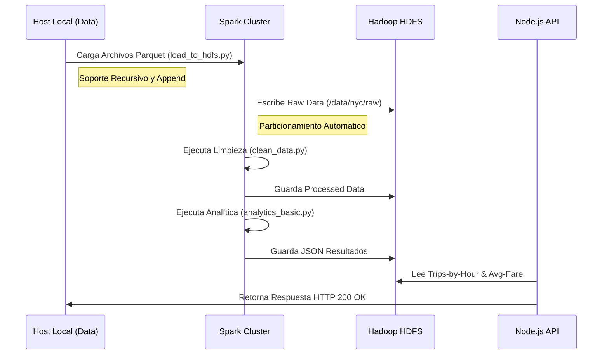

# Resumen de Actividades - Parte 1: Estabilización y Automatización del Entorno

## 1. Introducción y Objetivo
El objetivo de esta primera fase fue estabilizar el entorno de Big Data (Hadoop + Spark), corregir fallos críticos de conectividad e integridad de datos, y establecer un flujo de trabajo automatizado y robusto para la ingestión y análisis de datos de taxis de NYC, culminando en la exposición de resultados vía API REST.

## 2. Resolución de Incidencias Críticas

### 2.1. Conectividad HDFS DataNode
*   **Problema Detectado**: El contenedor `hadoop-datanode` fallaba al intentar registrarse con el NameNode, reportando 0 nodos activos y errores de escritura (Replication 0).
*   **Diagnóstico**: La imagen docker base (`bde2020`) sobreescribía la configuración `fs.defaultFS` apuntando a la IP local del contenedor en lugar del NameNode.
*   **Solución Implementada**: Inyección forzada de la variable de entorno `CORE_CONF_fs_defaultFS=hdfs://hadoop-namenode:8020` en `docker-compose.yml` para garantizar la resolución correcta de nombres.

### 2.2. Incompatibilidad de Esquema en Spark
*   **Problema Detectado**: Los trabajos de limpieza (`clean_data.py`) fallaban, impidiendo la generación de métricas para la API.
*   **Diagnóstico**: El script original buscaba columnas de geolocalización antiguas (`pickup_longitude`), incompatibles con el dataset 2025 que usa IDs de zona (`PULocationID`).
*   **Solución Implementada**: Refactorización del script `clean_data.py` y `analytics_basic.py` para adaptarse al nuevo esquema de datos.

## 3. Arquitectura del Sistema Implementada

El siguiente diagrama ilustra la interacción entre los contenedores Docker y el flujo de comunicación establecido:

## 4. Flujo de Datos y Pipeline de Procesamiento

Se estableció un pipeline completo desde la carga de datos crudos hasta la exposición en la API.

## 5. Automatización y Herramientas Desarrolladas

Para facilitar la gestión y evitar errores manuales, se desarrolló una suite de scripts batch (`.bat`) documentada en `docs/scripts_automatizacion.md`:

| Script | Función Principal | Características Clave |
| :--- | :--- | :--- |
| **`verify_env.bat`** | Orquestador Maestro | Verifica contenedores, crea carpetas HDFS, carga datos (solo si está vacío), ejecuta analítica y prueba la API. |
| **`check_api.bat`** | Verificación de API | Prueba endpoints HTTP y valida respuestas 200 OK. |
| **`load_new_data.bat`** | Carga Incremental | Carga recursiva de datos nuevos (append) manteniendo estructura de carpetas. Genera reportes. |
| **`list_hdfs_files.bat`** | Monitorización | Lista el contenido actual del directorio de datos en HDFS. |
| **`delete_hdfs_data.bat`** | Gestión de Ciclo de Vida | Permite borrado total (reset) o parcial de datos en HDFS. |

## 6. Mejoras en Logging y Reportes

Se implementó un sistema de observabilidad para los procesos de fondo:

*   **Logs de Ejecución**: Redirección automática de `STDOUT` y `STDERR` de los trabajos Spark a la carpeta local `spark-jobs/outputs/`.
*   **Reportes de Carga**: El script de carga genera archivos de texto en `data/outputs-data/` detallando:
    *   Archivos procesados.
    *   Estado de éxito/error por archivo.
    *   Rutas de destino en HDFS (respetando subdirectorios).

## 7. Conclusión de la Parte 1

El sistema es ahora **estable, observable y funcional**. La infraestructura subyacente soporta correctamente el ciclo de vida de los datos, y la API está lista para ser consumida por aplicaciones frontend o clientes externos. La base está lista para la expansión de funcionalidades en la Parte 2.
