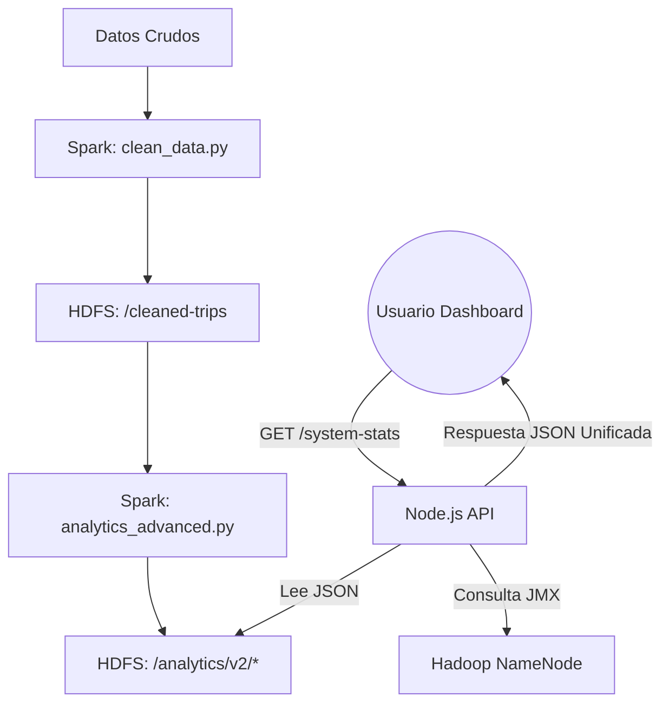

# Resumen Fase 2: Analítica Avanzada y API Dashboard

## 1. Objetivo Logrado
Se ha transformado la infraestructura base (Fase 1) en una plataforma de datos capaz de alimentar un Dashboard moderno. Se implementaron 6 endpoints analíticos de alto rendimiento que responden en milisegundos, gracias a una estrategia de **Pre-agregación en Spark** y **Streaming directo desde HDFS**.

## 2. Componentes Desarrollados

### A. Capa de Procesamiento (Spark)
Se creó el job `spark-jobs/analytics_advanced.py` que genera 5 datasets JSON optimizados para visualización:
1.  **Series de Tiempo**: Viajes y tarifas promedio por día (`trips-over-time`).
2.  **Métodos de Pago**: Distribución porcentual Tarjeta vs Efectivo (`payment-stats`).
3.  **Zonas Top**: Ranking de las 20 zonas con más recogidas (`top-zones`).
4.  **Análisis de Propinas**: Correlación entre distancia y % de propina (`tip-analysis`).
5.  **Histograma**: Distribución de distancias de viaje (`distance-distribution`).

### B. Capa de Servicio (Node.js API V2)
Se implementó un nuevo enrutador `dashboard.routes.js` bajo el prefijo `/api/v2`.
-   **Lectura Eficiente**: Usa `webhdfs` para leer los resultados de Spark directamente.
-   **Adaptabilidad**: Transforma on-the-fly formatos NDJSON de Spark a JSON Arrays estándares para el Frontend.
-   **Infraestructura**: Se mejoró `hdfs.service.js` para consultar métricas JMX del NameNode y estadísticas de disco.

### C. Endpoint Estrella: System Stats
Se desarrolló `/api/v2/system-stats` para el "Home" del Dashboard. Este endpoint unifica 3 fuentes de datos en una sola respuesta:
*   **Negocio**: Calcula totales de viajes y rangos de fechas en tiempo real sumando los pre-agregados.
*   **Sistema de Archivos**: Consulta uso de disco y conteo de archivos en `/data/nyc`.
*   **Salud del Cluster**: Consulta JMX para reportar DataNodes activos y salud de bloques.

## 3. Endpoints Disponibles (Rutas Completas)

| Métrica | Ruta Completa (Click para probar) |
| :--- | :--- |
| **Home Stats** | [http://localhost:3000/api/v2/system-stats](http://localhost:3000/api/v2/system-stats) |
| **Tendencia** | [http://localhost:3000/api/v2/trips-over-time](http://localhost:3000/api/v2/trips-over-time) |
| **Pagos** | [http://localhost:3000/api/v2/payment-stats](http://localhost:3000/api/v2/payment-stats) |
| **Zonas Top** | [http://localhost:3000/api/v2/top-zones](http://localhost:3000/api/v2/top-zones) |
| **Propinas** | [http://localhost:3000/api/v2/tip-analysis](http://localhost:3000/api/v2/tip-analysis) |
| **Distancias** | [http://localhost:3000/api/v2/distance-distribution](http://localhost:3000/api/v2/distance-distribution) |

## 4. Diagrama de Flujo de Datos Final

## 5. Conclusión
La Fase 2 completó el ciclo del dato: desde su ingesta masiva hasta su consumo refinado en una API REST lista para producción. El sistema ahora soporta tanto analítica histórica pesada (Spark) como monitoreo de infraestructura en tiempo real.
